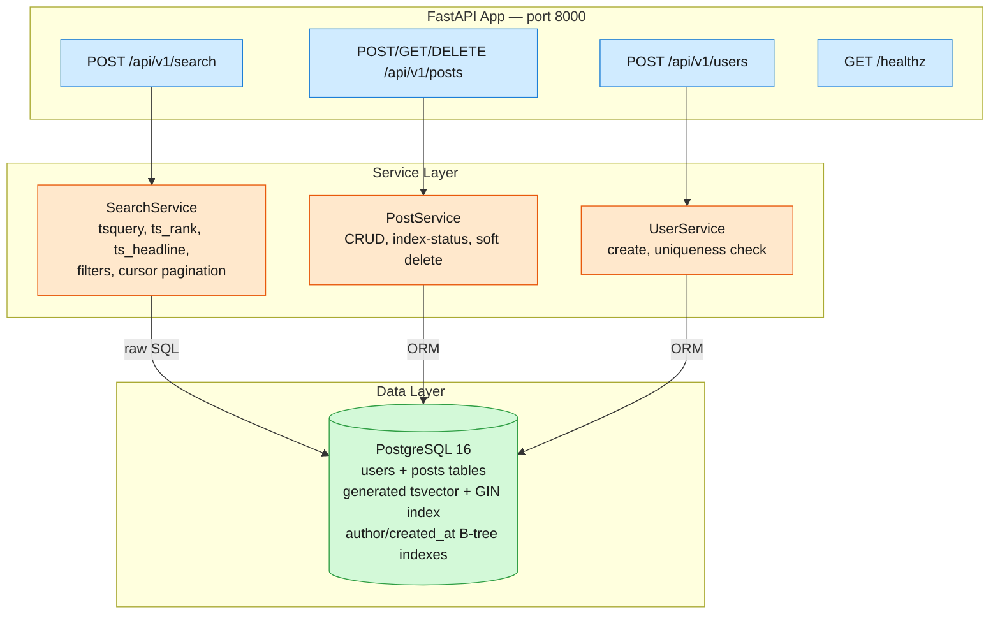

# Post Search MVP

FastAPI-based full-text search backend for user posts, backed by **PostgreSQL 16's built-in tsvector/GIN full-text search** — no Elasticsearch, no Redis, no Kafka. Posts are searchable immediately on creation.

## Quick Start

```bash
# Start the stack (app + Postgres 16)
docker compose up --build -d

# Run acceptance tests
docker compose exec app pytest verify/acceptance -q

# Run white-box tests (requires running Postgres)
docker compose exec app pytest tests/ -v
```

Full deploy walkthrough: see [DEPLOY.md](DEPLOY.md).

## Stack

| Component | Technology | Role |
|-----------|-----------|------|
| HTTP layer | **FastAPI** (Python 3.12) | Async request handlers, Pydantic validation |
| Database | **PostgreSQL 16** | Primary store + inverted index (generated tsvector + GIN) |
| ORM | **SQLAlchemy 2.0** + asyncpg | Async data access |
| Migrations | **Alembic** | Schema versioning (auto-runs on container start) |
| Deployment | **Docker Compose** | Multi-service orchestration with healthchecks |

## Architecture



Routers parse HTTP and delegate to services — no business logic. Services own the domain logic and data access. All state lives in Postgres; the generated `fts_vector` column is the inverted index, maintained automatically by Postgres on INSERT/UPDATE. One process, one database — no Redis, no Kafka, no separate index tier.

## API Overview

| Method | Path | Description |
|--------|------|-------------|
| `GET` | `/healthz` | Health check — `{"status":"ok"}` |
| `POST` | `/api/v1/users` | Create a user (username, unique) |
| `POST` | `/api/v1/posts` | Create a post (searchable immediately) |
| `GET` | `/api/v1/posts/{post_id}` | Post detail with author info |
| `GET` | `/api/v1/posts/{post_id}/index-status` | Indexing status (always indexed) |
| `DELETE` | `/api/v1/posts/{post_id}` | Soft-delete a post |
| `POST` | `/api/v1/search` | Full-text search with filters + pagination |

### Search

**Request:**
```json
POST /api/v1/search
{
  "query": "hello world",
  "mode": "lexical",
  "filters": {
    "author_id": "uuid",
    "date_from": "2026-01-01T00:00:00Z",
    "date_to": "2026-06-30T23:59:59Z",
    "language": "en"
  },
  "page_size": 20,
  "page_token": "base64hmac..."
}
```

**Response:**
```json
{
  "results": [
    {
      "post_id": "uuid",
      "author_id": "uuid",
      "author_username": "alice",
      "text_snippet": "hello <mark>world</mark> from ...",
      "highlights": ["world"],
      "score": 0.68,
      "created_at": "2026-07-01T12:00:00Z"
    }
  ],
  "next_page_token": "base64hmac..."
}
```

### Search modes

| Mode | Status | Behaviour |
|------|--------|-----------|
| `lexical` | ✅ MVP | Postgres FTS via `websearch_to_tsquery` + `ts_rank` |
| `semantic` | 🚧 V2 | Returns `501 Not Implemented` |
| `hybrid` | 🚧 V2 | Returns `501 Not Implemented` |

## Project Layout

```
src/post_search/           # Application code
├── main.py                # create_app() factory, lifespan
├── config.py              # pydantic-settings (env-driven)
├── database.py            # async engine + session dependency
├── models/                # SQLAlchemy ORM models
│   ├── user.py            # User (uuid PK, unique username)
│   └── post.py            # Post (generated tsvector + GIN index)
├── schemas/               # Pydantic request/response models
│   ├── user.py, post.py, search.py, common.py
├── routers/               # FastAPI route handlers
│   ├── health.py, users.py, posts.py, search.py
└── services/              # Business logic
    ├── user_service.py, post_service.py, search_service.py

tests/                     # White-box unit tests (4 test files)
verify/acceptance/         # Black-box acceptance tests (6 test files)
alembic/                   # Schema migration (001_initial.py)
docs/                      # system-design.md, mvp-scope.md
```

## Testing

### White-box tests (unit + integration)

Run against a running Postgres via `docker compose exec`:

```bash
docker compose exec app pytest tests/ -v
```

| Suite | File | Tests | Coverage |
|-------|------|-------|----------|
| Health | `tests/test_health.py` | 1 | GET /healthz → 200 |
| User service | `tests/test_user_service.py` | 4 | Create, duplicate (409), empty (422), long (422) |
| Post service | `tests/test_post_service.py` | 8 | Create, unknown author (404), detail, index-status, soft delete, double-delete (404), empty text (422), invalid language (422) |
| Search service | `tests/test_search_service.py` | 7 | Keyword search, empty query (422), semantic/hybrid (501), author filter, cursor pagination, invalid token (400), highlighting |

### Acceptance tests (black-box)

Run against the running Docker stack:

```bash
docker compose exec app pytest verify/acceptance -q
```

| File | FR | What it asserts |
|------|----|-----------------|
| `test_healthz.py` | Health | GET /healthz → 200 |
| `test_fr1_keyword_search.py` | FR1 | Keyword/ranked search, phrase search, mode validation |
| `test_fr3_filtered_search.py` | FR3 | Author/date range/language filters, combined filters |
| `test_fr4_realtime_indexing.py` | FR4 | Post create → immediately searchable, soft delete excludes from results |
| `test_fr5_pagination.py` | FR5 | Multi-page cursor, disjoint pages, malformed token → 400 |
| `test_fr6_highlighting.py` | FR6 | `<mark>` tags in snippet, highlights array present |

## Design Decisions

| # | Decision | Rationale |
|---|----------|-----------|
| D1 | **Postgres FTS** over Elasticsearch | Single-node MVP; GIN-indexed tsvector provides sub-10ms lookup at this scale. Zero extra infra. |
| D2 | **Generated tsvector column** over Kafka | Adds ~1ms to INSERT; no background workers needed. Posts are searchable immediately. |
| D3 | **Soft deletes** (`is_archived`) over index tombstoning | Avoids expensive GIN index page scans on delete. |
| D4 | **Stateless HMAC cursors** over server-side | No memory per active search; re-execution cost is negligible. |
| D5 | **ts_headline at query time** over stored positions | Applied only to final page (max 100 results) — ~5ms overhead. |
| D6 | **No semantic search** in MVP | Deferred to V2 (pgvector + embedding model). Lexical covers >80% of user intent. |

Full detail with per-decision trade-offs and back-of-the-envelope numbers: see [DESIGN.md](DESIGN.md).

## Out of Scope (MVP)

- Semantic / embedding search (V2 — pgvector + sentence transformers)
- Kafka event pipeline for ingest buffering
- Redis hot index / SSD segment tiering
- Sharding / scatter-gather
- Authentication / authorization
- Rate limiting

## Environment

Configured entirely through environment variables (set in `docker-compose.yml` or `.env`):

| Variable | Default | Description |
|----------|---------|-------------|
| `DATABASE_URL` | `postgresql+asyncpg://postsearch:postsearch@db:5432/postsearch` | Asyncpg connection string |
| `SECRET_KEY` | `change-me-in-production` | HMAC key for cursor pagination tokens |
| `APP_PORT` | `8050` | Host-side port for the app container |

## CI/CD

Three GitHub Actions workflows (see `.github/workflows/`):

- **lint.yml** — `ruff check` + `ruff format --check` on every PR/push to main
- **ci.yml** — Install deps, run unit tests, build Docker image
- **functional.yml** — `docker compose up`, run acceptance tests, tear down

All three must pass before merging.
